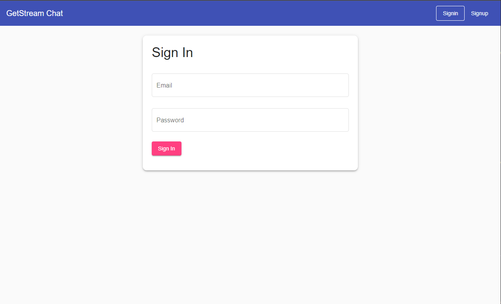
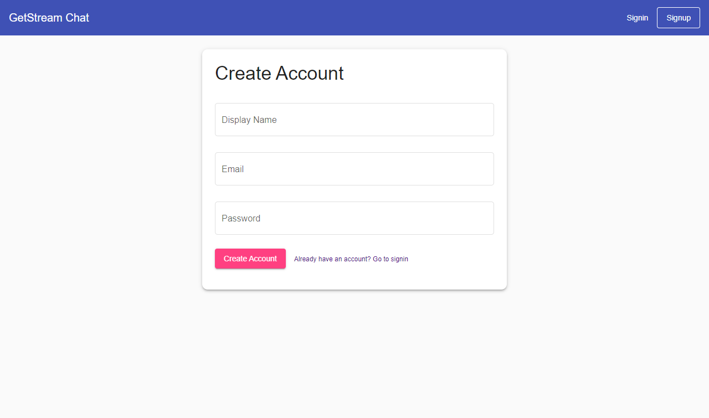
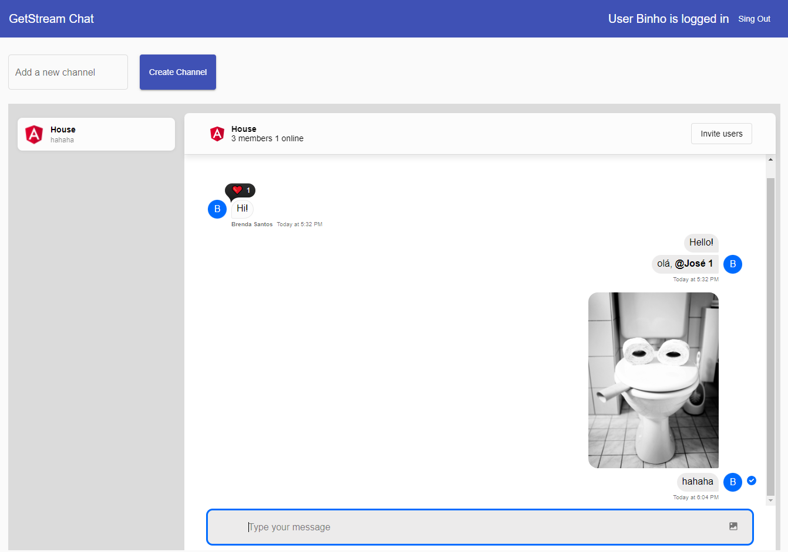

# Chat Online com GetStream.io e Angular 13

Este projeto consiste em um estudo pessoal sobre desenvolvimento de aplicações com conexão web socket

# Servidor de desenvolvimento

Execute `ng serve` para iniciar um servidor local. Navegue até `http://localhost:4211`.

# Telas

## Atenticação

  
  

Integração com o Firebase Authentication, utilizando o pacote `@angular/fire`.

## Chat

Componentes padrões do Angular providos por GetStream.io através dos pacotes `stream-chat-angular` e `stream-chat`.

# Integração GetStream.io + Firebase Functions

As funções do azure estão no arquivo `/functions/src/index.ts`

## Function createStreamUser

Essa função é executada quando o usuário é criado pelo Firebase e cria um usuário com os mesmo dados no GetStream.io.

## Function createStreamToken

Essa função cria e obtém o token da GetStream.io.

## Function revokeStreamToken

Essa função revoga o token atual do usuário logado no GetStream.io.
